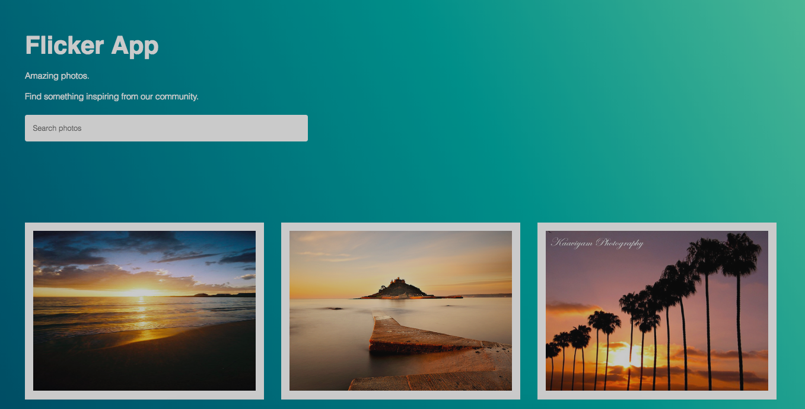

# Flickr App

Created a React and Redux photo app. The app allows the user to search for any tag and get 20 photos in return. The
app is mobile responsive using only css flexbox and the app is hosted on heroku.

## Built With

- [React](https://reactjs.org/) - Front End Framework
- [Redux](https://redux.js.org/) - State Container
- [Flickr API](https://www.flickr.com/services/feeds/docs/photos_public/) - External API
